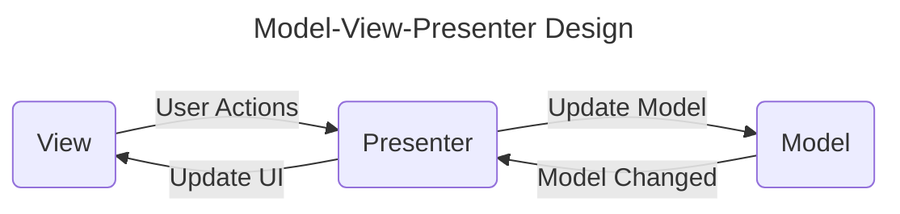
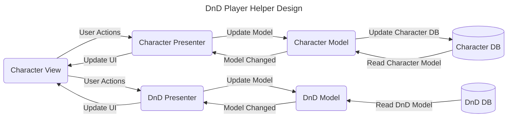

# dnd-player-helper

Tools for DnD players to manage their character

# Similar products

- https://www.dndbeyond.com/characters
- https://aurorabuilder.com/
- https://app.roll20.net/characters/welcome

# Design Philosophy

The software design shall follow a Model-View-Presenter design principle. 

In the **DnD Player Helper** there are two different models that need to be implemented. The actual player model and the model storing the DnD rules and data. There is however only one view (UI) that the player will interact with.
The main parts of the software are:

- Views 
    - *Provide the visualization of the data and keep a track of the user’s action*
    - The **Character View** showing the relevant character info and allowing for interaction with the player
- Models 
    - *Storage of data and handling communication with the database*
    - The **Character Model** storing all relevant info on a character. 
    - The **DnD Model** storing all rules and data on DnD
- Presenters 
    - *Fetch the data from the model and apply the UI logic to decide what to display*
    - *They manage the state of the Views and takes actions according to the user’s input notification from the Views*
    - The **Character Presenter** defines the logic to connect the Character model and it's data to the view
    - The **DnD Presenter** defines the logic to connect the **DnD Model** and it's data to the view (UI)
- Databases 
    - *Persistant data storage*
    - **Character Database** stores the character data between session
    - **DnD Database** stores the DnD rules and data between session

The resulting architecture for the DnD Player Helper based on a MVP design principle is shown below.

# Roadmap

At first a minimum viable product (MVP) shall be implemented that can be extended with new features. The MVP will implement the Model-View-Presenter design philosophy but be limited in feature scope. All components of the DnD Player Helper Design as shown above will have to be implemented. The implementation can be done modtly independent. The reduction in scope comes in form of the features that will be implemented at first.

## Features
Features are attributes and properties of a character. The initial features for the MVP are.
- Name
- Level
- Attributes
- Race
- Class