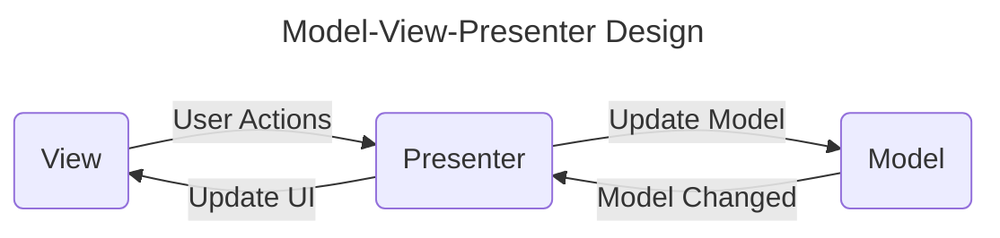
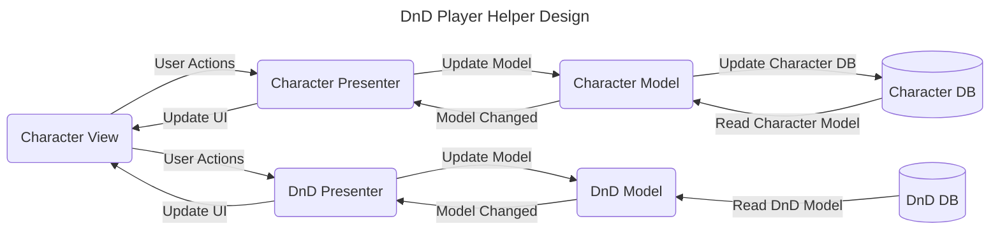
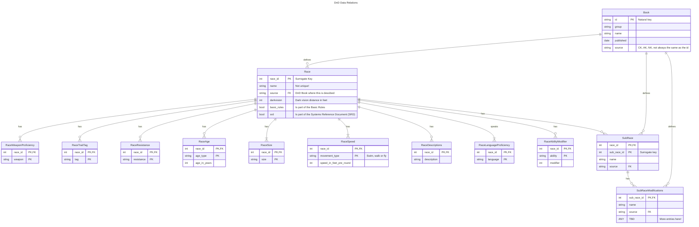

# dnd-player-helper

Tools for DnD players to manage their character

# Similar products

- https://www.dndbeyond.com/characters
- https://aurorabuilder.com/
- https://app.roll20.net/characters/welcome

# Design Philosophy

The software design shall follow a Model-View-Presenter design principle. 

In the **DnD Player Helper** there are two different models that need to be implemented. The actual player model and the model storing the DnD rules and data. There is however only one view (UI) that the player will interact with.
The main parts of the software are:

- Views 
    - *Provide the visualization of the data and keep a track of the user’s action*
    - The **Character View** showing the relevant character info and allowing for interaction with the player
- Models 
    - *Storage of data and handling communication with the database*
    - The **Character Model** storing all relevant info on a character. 
    - The **DnD Model** storing all rules and data on DnD
- Presenters 
    - *Fetch the data from the model and apply the UI logic to decide what to display*
    - *They manage the state of the Views and takes actions according to the user’s input notification from the Views*
    - The **Character Presenter** defines the logic to connect the Character model and it's data to the view
    - The **DnD Presenter** defines the logic to connect the **DnD Model** and it's data to the view (UI)
- Databases 
    - *Persistant data storage*
    - **Character Database** stores the character data between session
    - **DnD Database** stores the DnD rules and data between session

The resulting architecture for the DnD Player Helper based on a MVP design principle is shown below.

# Roadmap

At first a minimum viable product (MVP) shall be implemented that can be extended with new features. The MVP will implement the Model-View-Presenter design philosophy but be limited in feature scope. All components of the DnD Player Helper Design as shown above will have to be implemented. The implementation can be done modtly independent. The reduction in scope comes in form of the features that will be implemented at first.

## Features
Features are attributes and properties of a character. The initial features for the MVP are.
- Name
- Level
- Attributes
- Race
- Class

# DnD Database Structure

The targeted data structure targets to follow database normalization principals.
There are 5 rules to follow when setting up the database (or data structure) which are called **Normal Forms** and if the tables in the database forllow these they can be considered normalized. Database normalization ensures that tables and therefor the data structure is:
- Easier to understand
- Easier to enhance and extend
- Protected from:
    - insertion anomolies
    - deletion anomolies
    - update anamolies
all the anomolies represent forms of corrupting the database resulting in errors in the stored data.

### First Normal Form (1NF)
- Using row order to to convey information is not permitted
- Mixing data types within the same column is not permitted
- Having a table without a primary key is not permitted
- Repeating groups (lists) are not permitted

### Second Normal Form (2NF)
- Each Non key attribute in the table must be dependent on the entire primary key.

### Third Normal Form (3NF)
- Each non-key attribute in the table must depent on the key, the whole key and nothing but the key.

A stronger definition of 3NF also known as **Boyce-Codd Normal Form** (BCNF) is:

- Each ~~non-key~~ attribute in the table must depent on the key, the whole key and nothing but the key.

### Forth Normal Form (4NF)
- The only kinds of mulivalued dependencies in a table are multivalued dependencies on the key.

### Fith Normal Form (5NF)
- It must not be possible to describe the table as being the logical result of joing multiple other tables together.

## Race Data Structure

For some of the relations the data structure might change in the future. An example is the Race - Weapon Proficiency relation where the weapon is currently just a name. This can become a foreign key to a weapons table in the future. But the Weapon Proficency table does not have to change for this, other than weapon becoming a foreign key.
If possible ,the primary key in every table is choosen from natural keys, if a unique natural keys exists. This was not possible for the race however since races sometimes have different definitions in different sources. Instead of defining a composite key from (race_name, source), a surrogate key (race_id) is used. 